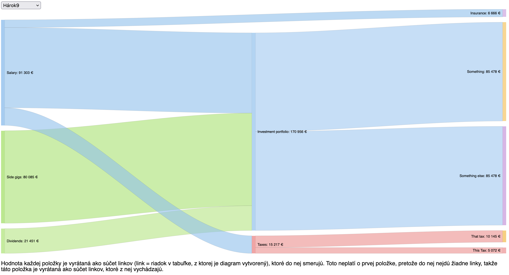
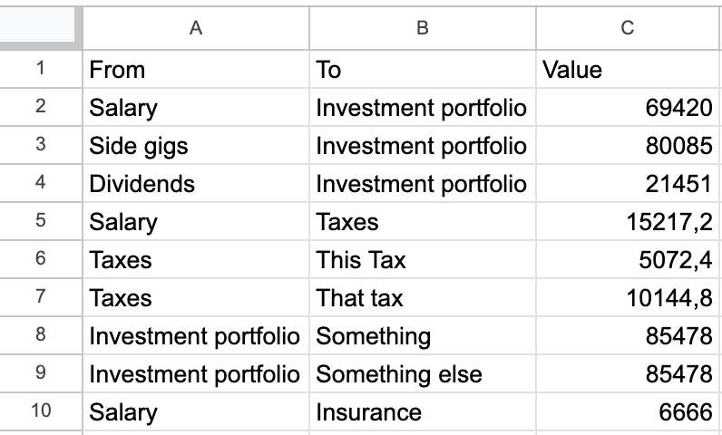
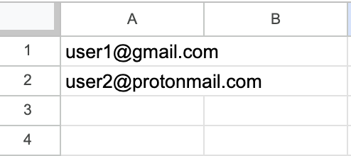

# Finance flow visualizer

## Description
Web application built with Node.js that displays a sankey diagram from Google Sheets data. For each sheet in a spreadsheet, there is a separate diagram accessible through a dropdown.

## Data preparation

- Fill (potentially multiple) google sheets with data in the following format (leave first row for column names):
  - Column A: Source
  - Column B: Target
  - Column C: Value

    

- Create a sheet called `allowed_google_users` with emails of users who should have access to the application.

    

## Local deployment
1. Install dependencies using `npm install`
1. Register the app with google (follow [this tutorial](https://www.passportjs.org/tutorials/google/register/) for example). You will also obtain values for `GOOGLE_CLIENT_ID` and `GOOGLE_CLIENT_SECRET` env variables
1. Enable google sheets API and obtain `GOOGLE_SHEETS_API_KEY` key [tutorial](https://developers.google.com/sheets/api/quickstart/nodejs)
1. Set the following environment variables:
   - `PORT=80`
   - `GOOGLE_CLIENT_ID=your_google_client_id`
   - `GOOGLE_CLIENT_SECRET=your_google_client_secret`
   - `GOOGLE_SHEETS_API_KEY=your_google_sheets_api_key`
   - `EXPRESS_SESSION_SECRET=your_session_secret` (anything)
   - `SPREADSHEET_ID=your_spreadsheet_id` (get it by visiting the spreadsheet and copying it from URL: `https://docs.google.com/spreadsheets/d/<SPREADSHEET_ID>`)
1. Run the application using `npm start`

## Deployment to google cloud
Follow the [gcloud documentation](https://cloud.google.com/run/docs/quickstarts/build-and-deploy/deploy-nodejs-service), don't forget to set env variables.

## Usage
- Access the application at `localhost`
- Authenticate using your Google account
- Upon successful authentication, you will be able to view the sankey diagram from the Google Sheets data
